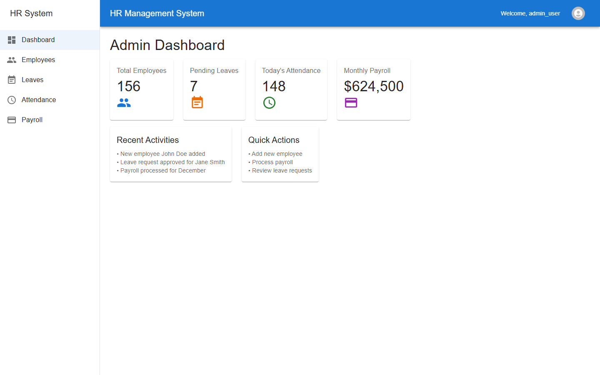
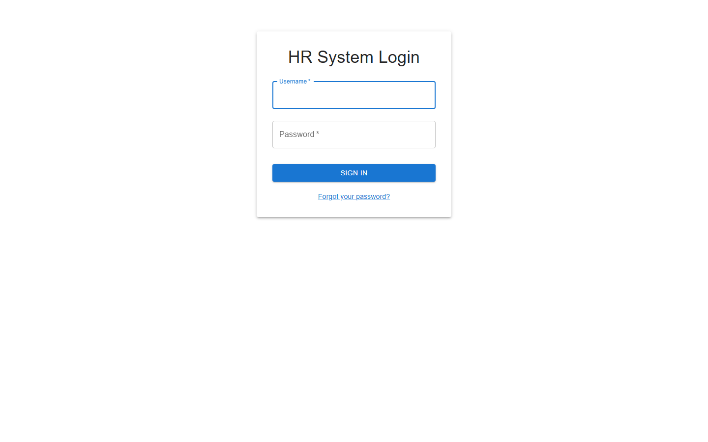

# 🏢 Enterprise HR Management System (HRMS)

**A high-performance, full-stack Human Resource Management & Analytics Platform built with Next.js 15, FastAPI, PostgreSQL, and Redis.**

[](https://nextjs.org/)
[](https://reactjs.org/)
[](https://fastapi.tiangolo.com/)
[](https://www.python.org/)
[](https://www.postgresql.org/)
[](https://redis.io/)
[](https://www.docker.com/)
[](https://prometheus.io/)
[](https://github.com/Talnz007/HR_Management/security)

<br />

[Why This Project Exists](#why-this-project-exists) • [Interface Showcase](#-interface-showcase) • [Key Features](#-key-features) • [Tech Stack](#-tech-stack) • [Getting Started](#-getting-started) • [API Endpoints](#-api-endpoints) • [Performance & Benchmarks](#-performance--benchmarks) • [Security & Audit](#-security--dependabot-audit) • [Project Structure](#-project-structure)

---

## Why This Project Exists

Workforce administration—tracking who is working, approving time off, computing salary deductions, and maintaining employee records—is frequently managed through messy spreadsheets or disconnected software. This system consolidates those core tasks into a single platform. It provides dedicated views for administrators, managers, and employees, automates PDF payslip generation, pushes real-time activity updates via WebSockets, and exposes Prometheus metrics for server health and latency monitoring.

---

## 📸 Interface Showcase

### Executive Admin Dashboard
*Workforce summary showing active headcount, today's attendance, pending leave requests, and monthly payroll aggregation.*



<br />

### Enterprise Role-Based Authentication
*Secure JWT-driven access control with password recovery, encrypted sessions, and granular permission enforcement (Admin, Manager, Employee).*



---

## 🌟 Key Features

| Domain | Capabilities |
| :--- | :--- |
| **👥 Workforce Administration** | Complete employee lifecycle management, department organizational tree, job title assignment, profile picture management, and automated ID allocation. |
| **⏱️ Smart Attendance Tracking** | Precision clock-in/clock-out tracking, daily attendance reports, status analytics (Present, Absent, Late), and historical attendance exports. |
| **🌴 Leave & Absence Workflow** | Multi-tier approval system (Employee submission &rarr; Manager review &rarr; Admin oversight) with automatic balance deduction and status notifications. |
| **💵 Payroll & Payslip Generation** | Monthly salary calculations factoring in base pay, overtime, and deductions with client-side PDF payslip rendering and download via `jsPDF`. |
| **⚡ Real-Time Communications** | Integrated Socket.IO engine pushing instant state sync and notifications across active browser tabs. |
| **📊 Telemetry & Observability** | Native Prometheus metrics tracking endpoint latency, HTTP status codes, and active request throughput at `/metrics`. |

---

## 🛠️ Tech Stack

- **Frontend:** Next.js 15, React 18, TypeScript, Tailwind CSS, Material UI, Axios, jsPDF
- **Backend:** FastAPI, Starlette, Uvicorn, Python-SocketIO, Pydantic V2
- **Database & Caching:** PostgreSQL, SQLAlchemy 2.0, Alembic, Redis
- **DevOps & Monitoring:** Docker, Docker Compose, Prometheus

---

## 🚀 Getting Started

### Prerequisites

Before running the application locally, ensure you have the following installed:

- **Node.js:** v20.x or v22.x LTS
- **Python:** 3.10 or newer
- **Docker & Docker Compose** (optional, for containerized setup)
- **PostgreSQL & Redis** (if running without Docker)

---

### Option A: Using Docker Compose (Fastest)

The included `docker-compose.yml` configures the FastAPI backend, Next.js frontend, PostgreSQL, Redis, and Prometheus in isolated containers.

```bash
# Clone the repository
git clone https://github.com/Talnz007/HR_Management.git
cd HR_Management

# Build and start all services
docker-compose up --build -d

# Verify container status
docker-compose ps
```

Once running, access the services at:
- **Frontend App:** http://localhost:3000
- **Backend API Docs (Swagger):** http://localhost:8000/docs
- **Database Admin UI (SQLAdmin):** http://localhost:8000/admin
- **Prometheus Metrics:** http://localhost:8000/metrics
- **Prometheus UI:** http://localhost:9090

To stop all containers:
```bash
docker-compose down
```

---

### Option B: Local Native Setup

#### 1. Backend

```bash
# In the project root, create a Python virtual environment
python -m venv .venv

# Activate the virtual environment
# Windows (PowerShell):
.venv\Scripts\Activate.ps1
# macOS/Linux:
# source .venv/bin/activate

# Install dependencies
pip install -r requirements.txt

# Set up environment variables
cp .env.example .env

# Run database migrations
alembic upgrade head

# Start the FastAPI server
uvicorn app.main:app --host 0.0.0.0 --port 8000 --reload
```

#### 2. Frontend

```bash
cd frontend

# Install Node dependencies
npm install --legacy-peer-deps

# Build the production bundle
npm run build

# Start the production server
npm run start
```

For frontend development with hot-reloading, run:
```bash
npm run dev
```

---

## 📡 API Endpoints

FastAPI generates interactive Swagger documentation available at `http://localhost:8000/docs`. Common endpoints include:

| Method | Endpoint | Description | Access |
| :--- | :--- | :--- | :--- |
| `POST` | `/auth/login` | Authenticate and retrieve JWT access token | Public |
| `GET` | `/users/me` | Fetch current authenticated user profile | Authenticated |
| `GET` | `/api/v1/admin/dashboard-stats` | Aggregated dashboard numbers (headcount, leaves, payroll) | Admin |
| `GET` | `/employees/` | List all employees | Admin, Manager |
| `POST` | `/employees/` | Register a new employee record | Admin |
| `GET` | `/departments/` | List all departments | Authenticated |
| `POST` | `/v1/attendance/` | Record clock-in or clock-out | Employee, Admin |
| `GET` | `/v1/leave/` | List leave requests | Authenticated |
| `POST` | `/v1/leave/` | Submit a new leave request | Employee |
| `GET` | `/payroll/` | List payroll records and salary calculations | Admin |
| `GET` | `/metrics` | Prometheus telemetry data | Public / Monitoring |

### Example Request: Fetching Dashboard Statistics

```bash
curl -X GET "http://localhost:8000/api/v1/admin/dashboard-stats" \
  -H "Authorization: Bearer <your_jwt_token>" \
  -H "Accept: application/json"
```

Expected response:
```json
{
  "total_employees": 156,
  "pending_leaves": 7,
  "today_attendance": 148,
  "monthly_payroll": 624500
}
```

---

## ⚡ Performance & Benchmarks

To test API throughput under load, run ApacheBench (`ab`) against the root health endpoint:

```bash
ab -n 1000 -c 50 http://127.0.0.1:8000/
```

Expected benchmark results:
```
Concurrency Level:      50
Time taken for tests:   ~0.4 seconds
Complete requests:      1000
Failed requests:        0
Requests per second:    ~2,400 [#/sec] (mean)
Time per request:       ~20 ms (mean)
```

To view real-time latency and request rate counters in Prometheus:
```bash
curl -s http://localhost:8000/metrics | grep http_request_duration_seconds_count
```

---

## 🛡️ Security & Dependabot Audit

All known security vulnerabilities have been audited and patched across Python and JavaScript ecosystems:
- **Next.js upgraded to 15.5.25**: Resolves critical unauthenticated RCE on Windows (`GHSA-p293-qw3h-jr36`) and image optimization SSRF/RCE (`GHSA-2xp9-vwfh-vxw4`).
- **Axios pinned to ^1.20.0**: Patches 25+ CVEs including prototype pollution, SSRF, and cloud credential exposure.
- **Python Dependencies**: Patched FastAPI (0.141.1), Starlette (0.46.1), SQLAdmin (0.31.1), Pillow (12.3.0), PyJWT (2.14.0), and Cryptography (50.0.1).
- **Audit Verification**: `npm audit` reports **0 vulnerabilities**.

For complete vulnerability remediation details and disclosure practices, see [SECURITY.md](SECURITY.md).

---

## 📁 Project Structure

```
HR_Management/
├── app/                      # FastAPI application source
│   ├── api/v1/               # Versioned API routes (auth, employees, leaves, payroll)
│   ├── core/                 # Security utilities, auth handlers, logging
│   ├── models/               # SQLAlchemy ORM models
│   ├── schemas/              # Pydantic request/response schemas
│   ├── services/             # Core business logic
│   ├── admin_views.py        # SQLAdmin view definitions
│   ├── database.py           # Database connection and session factory
│   ├── main.py               # Application factory, middleware, route registration
│   └── socket.py             # Socket.IO ASGI server instance
├── frontend/                 # Next.js 15 application
│   ├── app/                  # App Router pages and layouts
│   │   ├── (auth)/login/     # Login view
│   │   ├── admin/            # Admin views (dashboard, employees, payroll, attendance)
│   │   ├── attendance/       # Employee attendance view
│   │   ├── dashboard/        # Standard user dashboard
│   │   ├── leaves/           # Leave request views
│   │   └── services/         # Axios API clients
│   ├── components/           # Reusable UI components
│   ├── package.json          # Node dependencies
│   └── next.config.mjs       # Next.js configuration
├── docs/screenshots/         # Application screenshots
├── prometheus/               # Prometheus configuration
├── docker-compose.yml        # Multi-container orchestration
├── requirements.txt          # Pinned Python dependencies
├── SECURITY.md               # Vulnerability audit and security disclosure policy
└── README.md                 # Project documentation
```

---

## 📄 License

This project is open-source software licensed under the [MIT License](LICENSE).
